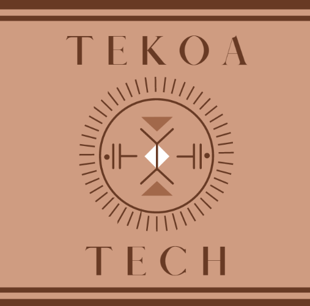

  

# TekoaTech: Conectando as Comunidades Indígenas com o Mundo Digital
Projeto final da disciplina de Base de Dados. Aqui desenvolvemos um SGBD completo.

## Membros

* 11857323 - Alexandre Brito Gomes
* 11883476 - Diógenes Silva Pedro
* 11834331 - João Antônio Misson Milhorim
* 11819125 - Pedro Augusto Ribeiro Gomes
* 11796451 - Pedro Kenzo Muramatsu Carmo

## Descrição do Projeto

Levar acesso à internet ao povo indígena no Brasil é uma questão crucial para a promoção da inclusão digital e para garantir que os indivíduos indígenas tenham as mesmas oportunidades de participar no mundo digital como qualquer outro cidadão brasileiro. A falta de acesso à internet pode excluir os povos indígenas de serviços e recursos importantes, bem como limitar o acesso à educação, saúde, empregos e oportunidades de negócios.

## Agradecimentos

# Implantação da base de dados e implementação do Sistema

